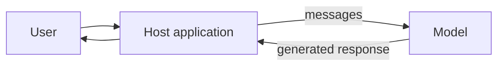
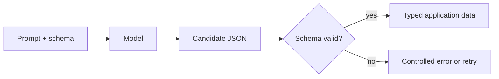
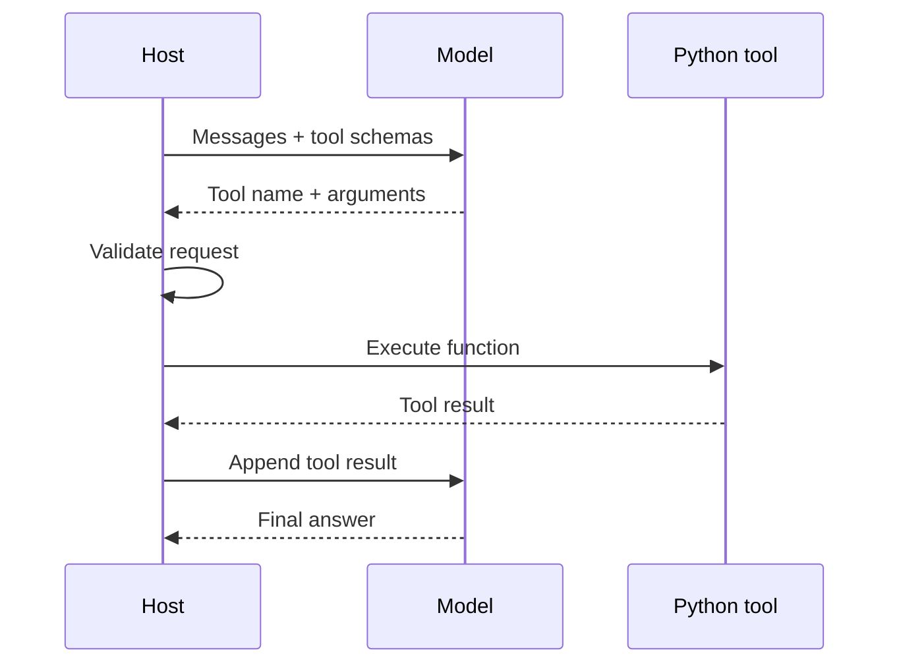
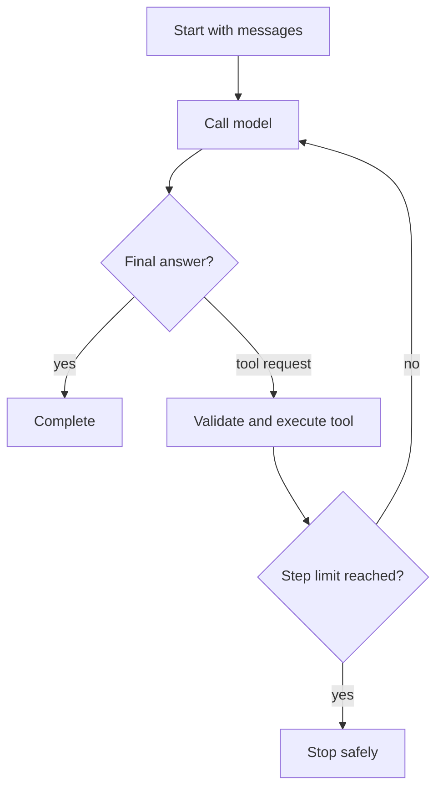
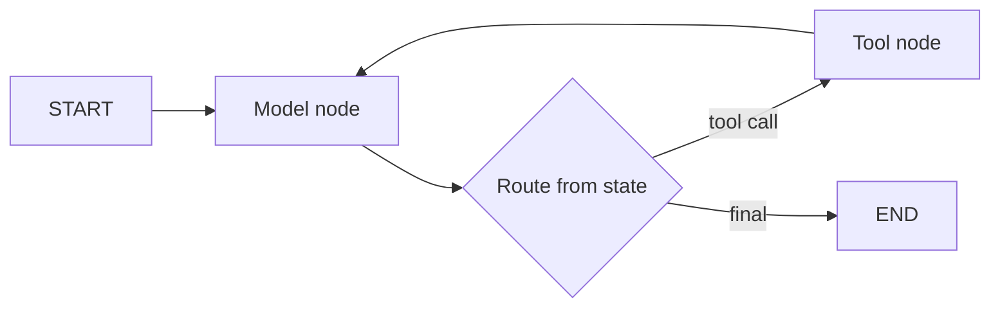

# Day 1 diagram sources

## D01 — Basic LLM application

Text alternative: the host sends user messages to the model and returns the model response.

## D02 — Structured output and validation

## D03 — Tool-calling sequence

## D04 — Manual bounded agent loop

## D05 — Small LangGraph state flow

