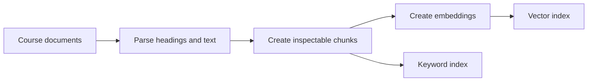
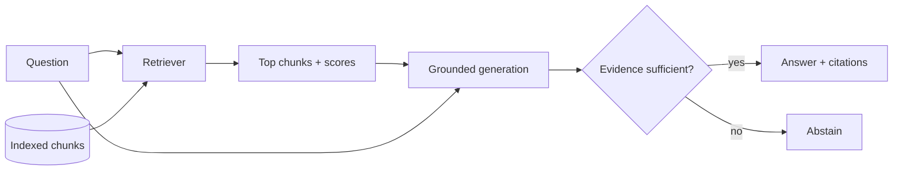

# Day 2 diagram sources

## D06 — Document ingestion pipeline

## D07 — RAG query pipeline

Text alternative: retrieval chooses evidence before generation; insufficient evidence produces abstention.
