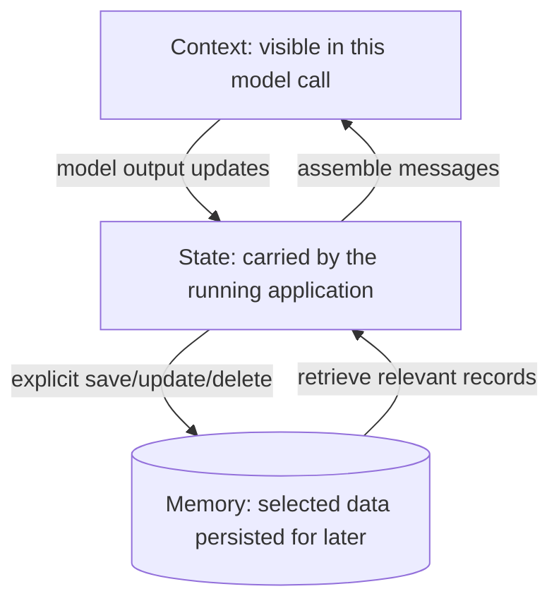
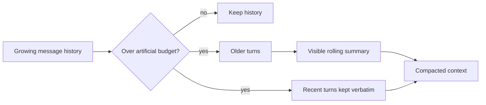
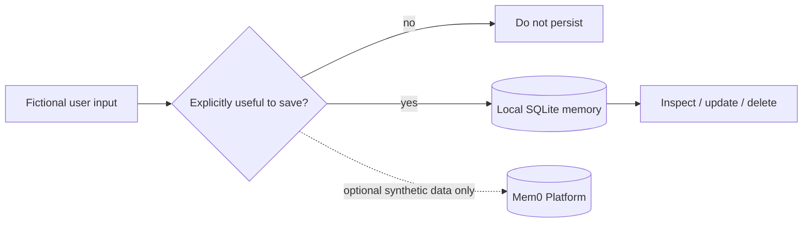
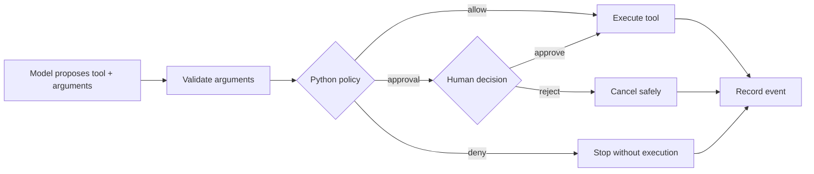

# Day 3 diagram sources

## D08 — Context, state, and memory

```mermaid
flowchart TB
    C["Context: visible in this model call"]
    S["State: carried by the running application"]
    M[("Memory: selected data persisted for later")]
    M -->|"retrieve relevant records"| S
    S -->|"assemble messages"| C
    C -->|"model output updates"| S
    S -->|"explicit save/update/delete"| M
```

## D09 — Context compaction

```mermaid
flowchart LR
    H["Growing message history"] --> B{"Over artificial budget?"}
    B -->|"no"| K["Keep history"]
    B -->|"yes"| O["Older turns"] --> S["Visible rolling summary"]
    B -->|"yes"| R["Recent turns kept verbatim"]
    S --> C["Compacted context"]
    R --> C
```

## D10 — Memory lifecycle and hosted boundary

```mermaid
flowchart LR
    U["Fictional user input"] --> X{"Explicitly useful to save?"}
    X -->|"no"| N["Do not persist"]
    X -->|"yes"| L[("Local SQLite memory")]
    L --> CRUD["Inspect / update / delete"]
    X -. "optional synthetic data only" .-> H[("Mem0 Platform")]
```

## D11 — Permission and human approval

```mermaid
flowchart LR
    A["Model proposes tool + arguments"] --> V["Validate arguments"]
    V --> P{"Python policy"}
    P -->|"allow"| T["Execute tool"]
    P -->|"approval"| H{"Human decision"}
    H -->|"approve"| T
    H -->|"reject"| C["Cancel safely"]
    P -->|"deny"| D["Stop without execution"]
    T --> E["Record event"]
    C --> E
    D --> E
```
