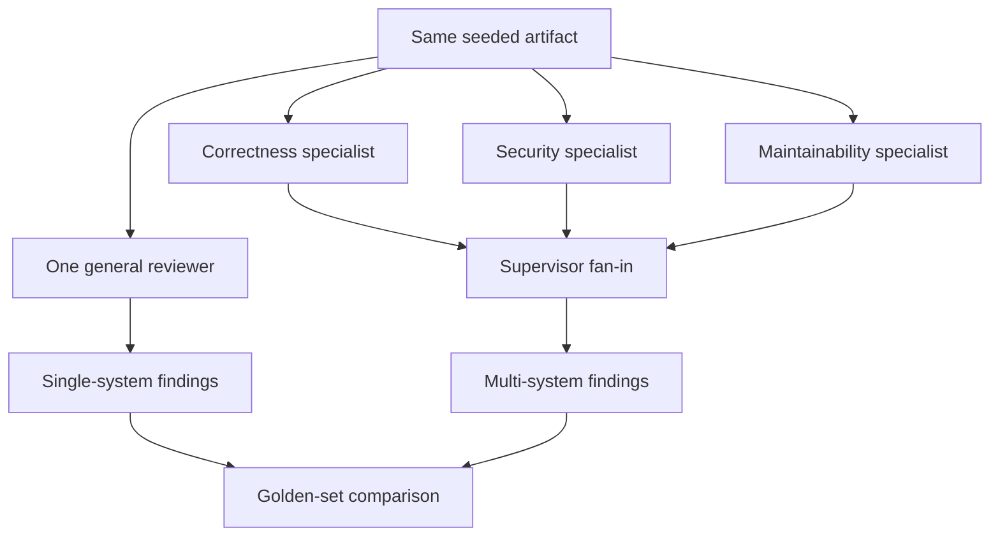
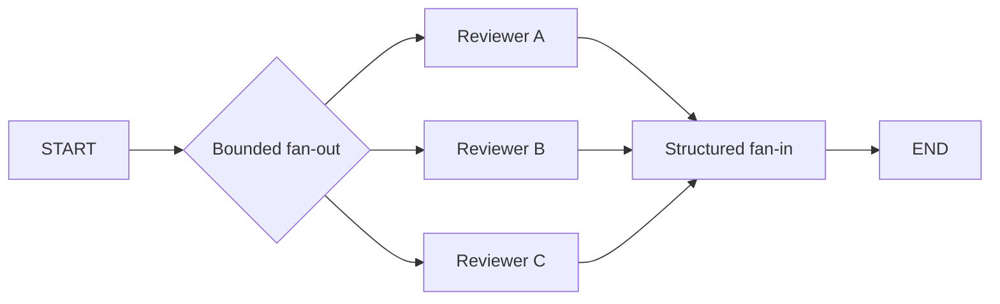
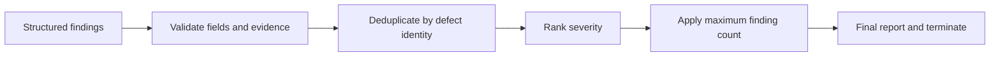
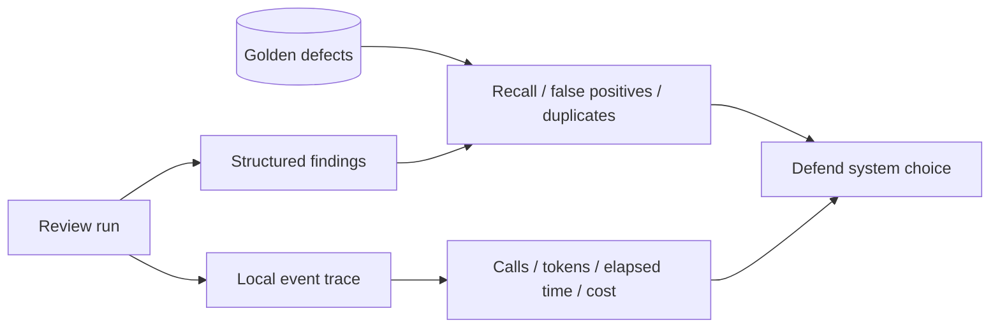

# Day 4 diagram sources

## D12 — Single versus specialist review

```mermaid
flowchart TB
    A["Same seeded artifact"] --> S["One general reviewer"]
    A --> C["Correctness specialist"]
    A --> Q["Security specialist"]
    A --> M["Maintainability specialist"]
    S --> ES["Single-system findings"]
    C --> F["Supervisor fan-in"]
    Q --> F
    M --> F
    F --> EM["Multi-system findings"]
    ES --> AB["Golden-set comparison"]
    EM --> AB
```

## D13 — Parallel fan-out and fan-in

```mermaid
flowchart LR
    START --> SPLIT{"Bounded fan-out"}
    SPLIT --> A["Reviewer A"]
    SPLIT --> B["Reviewer B"]
    SPLIT --> C["Reviewer C"]
    A --> JOIN["Structured fan-in"]
    B --> JOIN
    C --> JOIN
    JOIN --> END
```

## D14 — Supervisor synthesis

```mermaid
flowchart LR
    F["Structured findings"] --> V["Validate fields and evidence"]
    V --> D["Deduplicate by defect identity"]
    D --> R["Rank severity"]
    R --> B["Apply maximum finding count"]
    B --> O["Final report and terminate"]
```

## D15 — Observability and evaluation

```mermaid
flowchart LR
    RUN["Review run"] --> EVENTS["Local event trace"]
    RUN --> FIND["Structured findings"]
    GOLD[("Golden defects")] --> METRICS["Recall / false positives / duplicates"]
    FIND --> METRICS
    EVENTS --> COST["Calls / tokens / elapsed time / cost"]
    METRICS --> DECIDE["Defend system choice"]
    COST --> DECIDE
```
