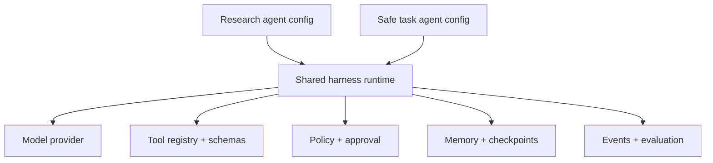
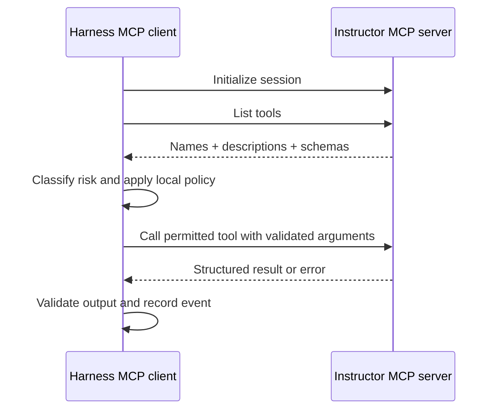
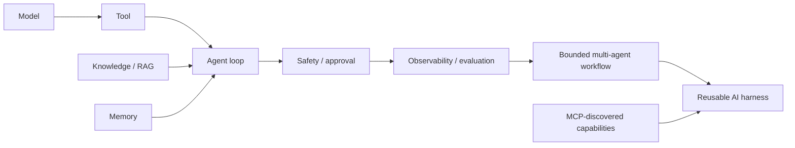
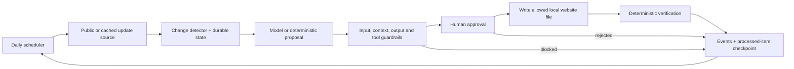

# Day 5 diagram sources

## D16 — Reusable two-agent harness

## D17 — MCP client consuming an instructor server

## D18 — Complete course layer map

Text alternative: the course grows from model calls to reusable infrastructure; safety and observability govern execution rather than appearing as optional add-ons.

## D19 — Recurring website-maintenance cycle

Text alternative: scheduling only triggers a bounded check. External content is validated, the proposal is guarded, a human approves the exact patch, and only then does a verified persistent change occur.
