# LangChain track diagram sources

## D20 — A LangChain chat model call

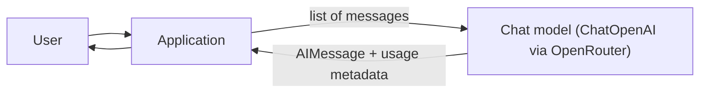

Text alternative: the application sends a typed message list to the chat model and receives one AIMessage; nothing persists between calls.

## D21 — Tool calling and the hand-written agent loop

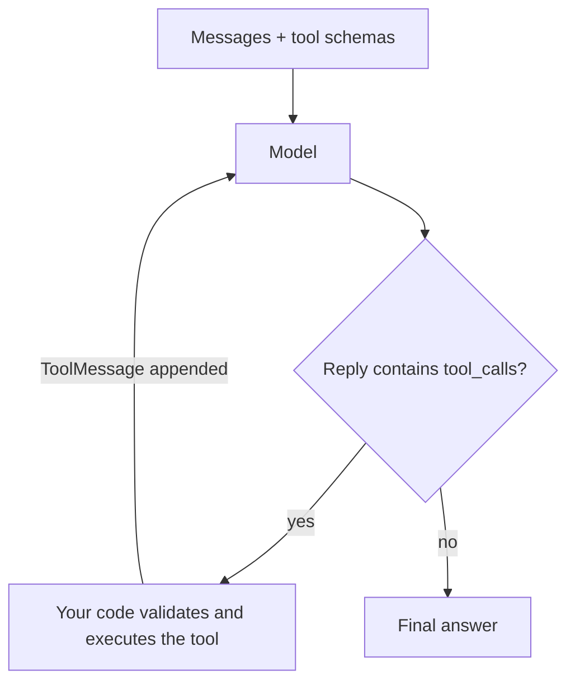

Text alternative: the model requests a tool by name and arguments; the application executes it and appends the ToolMessage; the loop repeats until the model answers or the step limit is hit.

## D22 — The create_agent graph

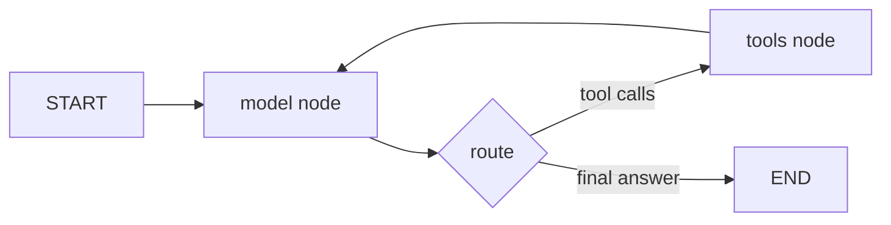

Text alternative: create_agent compiles the agent loop as a LangGraph graph with a model node, a tools node and a conditional edge between them.

## D23 — Structured output as a tool call

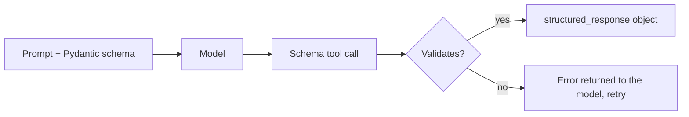

Text alternative: with ToolStrategy the schema becomes a tool; the model's call is validated by Pydantic and exposed as structured_response, or returned as an error for another attempt.

## D24 — Memory layers around the agent

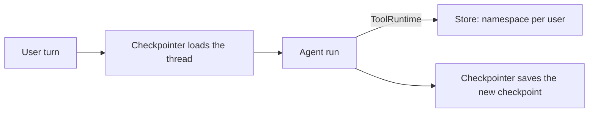

Text alternative: short-term memory is the thread checkpoint loaded and saved around each run; long-term memory is a store keyed by user that tools reach through ToolRuntime.

## D25 — Retrieval and RAG

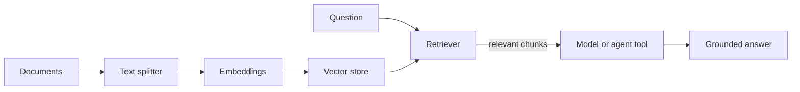

Text alternative: documents are split, embedded and stored once; at query time the retriever returns the nearest chunks, which are given to the model directly (2-step RAG) or through a search tool (agentic RAG).

## D26 — Middleware around the model and the tools

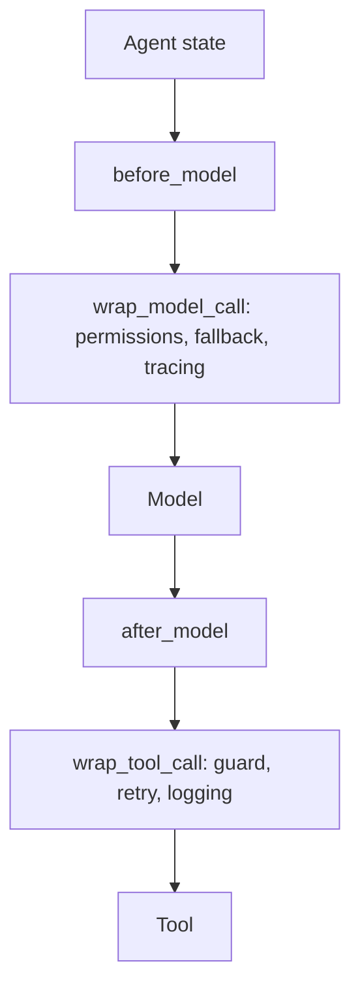

Text alternative: middleware hooks run before and around the model call and around each tool call, which is where logging, limits, retries, fallbacks and authorisation live.

## D27 — Human-in-the-loop approval

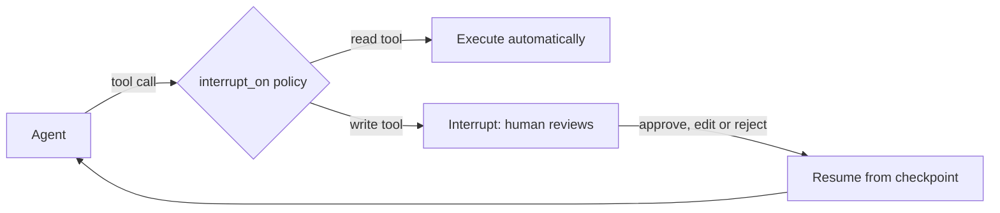

Text alternative: tools listed in the approval policy pause the run at a checkpoint; the human's decision resumes it, so the write happens only after approval or edit.

## D28 — An explicit LangGraph workflow

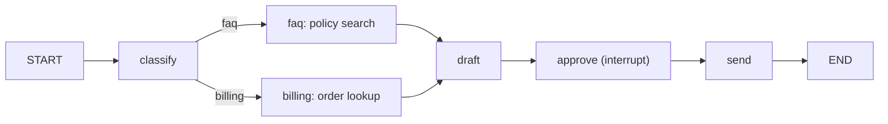

Text alternative: a fixed support workflow as a graph: classify, branch to the right evidence node, draft, pause for approval, send.

## D29 — Supervisor with specialists as tools

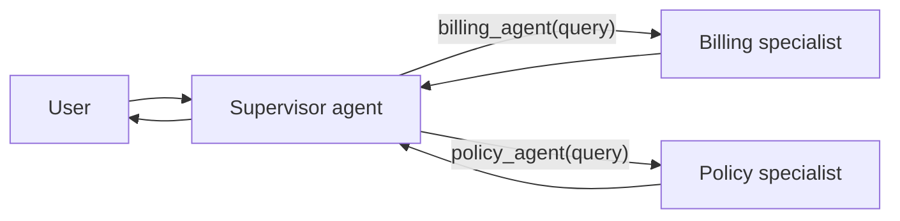

Text alternative: the supervisor sees each specialist as one tool, delegates self-contained questions, and combines the replies.

## D30 — The production shape

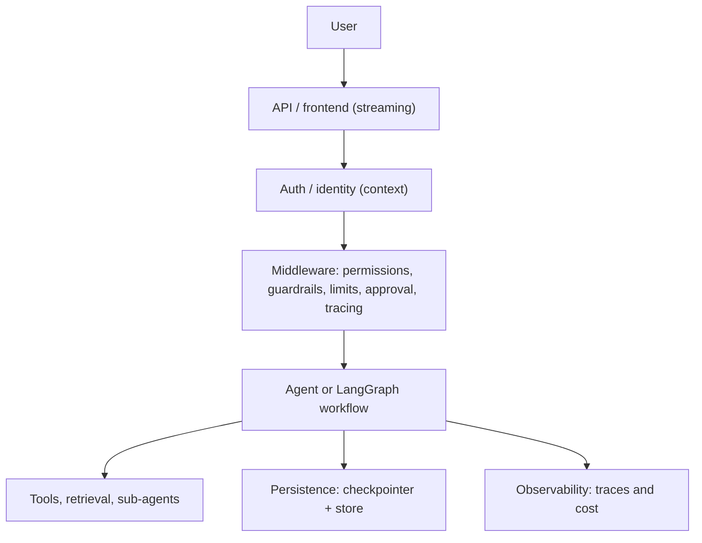

Text alternative: user requests pass through the API, identity and a middleware stack before reaching the agent, which uses tools, retrieval and sub-agents while persistence and observability sit alongside.
