# LangGraph track diagram sources

## D31 — State, nodes and edges

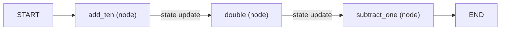

Text alternative: a state dictionary enters at START, each node returns a partial update that is merged into it, and edges fix the order until END.

## D32 — Conditional edge and loop

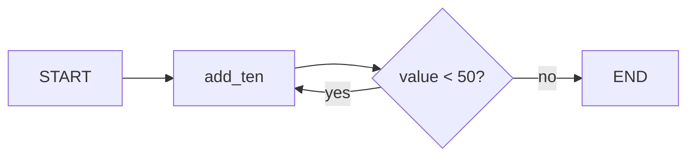

Text alternative: a routing function reads the state after a node and returns the name of the next node; pointing it back at the same node makes a loop that ends when the condition fails.

## D33 — The model as a node with a messages reducer

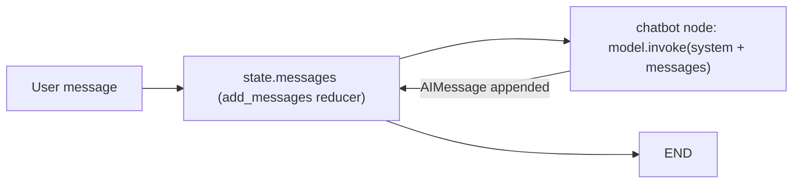

Text alternative: the chatbot node reads the message list from state, calls the model, and returns the reply; the add_messages reducer appends it instead of replacing the list.

## D34 — The agent loop as a graph

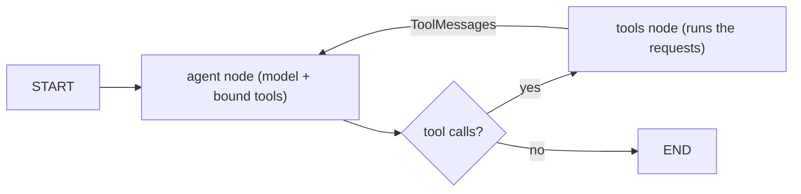

Text alternative: the agent node asks the model; if the reply requests tools the tools node executes them and control returns to the agent; otherwise the run ends.

## D35 — Structured output feeding a router

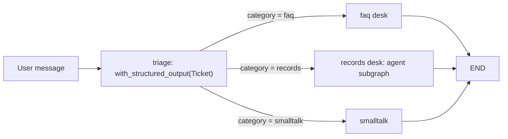

Text alternative: the triage node makes the model fill in a validated Ticket object; a conditional edge reads its category and sends the message to the handbook desk, the records desk (a compiled agent graph used as a node) or a small-talk reply.

## D36 — Checkpointer, threads and context management

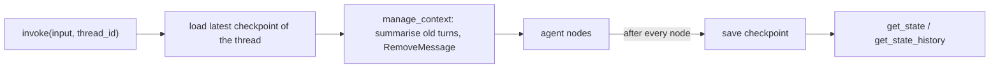

Text alternative: with a checkpointer each invocation loads the thread's saved state, a context-management node keeps the message list short, the nodes run, and a checkpoint is saved after each of them.

## D37 — Long-term memory through the store and runtime context

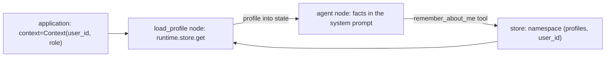

Text alternative: the application passes the user identity as runtime context; a profile-loading node reads that user's facts from the store into the state, the agent puts them in its prompt, and a remember tool writes new facts back under the same namespace.

## D38 — Retrieval by meaning

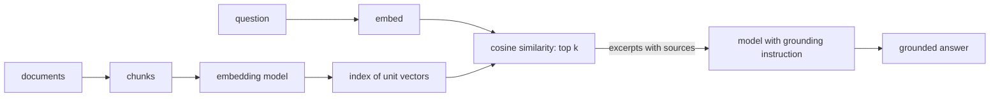

Text alternative: documents are embedded once into an index; a question is embedded, the nearest chunks are found by cosine similarity, and the model answers only from those excerpts, either inside a fixed faq node or through a search tool the agent calls.

## D39 — Permissions, guard and approval on write tools

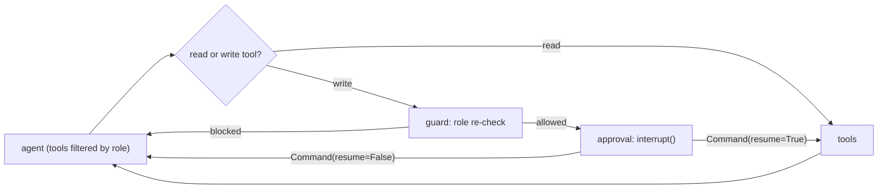

Text alternative: the model only sees the tools its caller's role allows; write requests pass a guard node that re-checks the role and an approval node that pauses with interrupt; a rejection at either point returns rejection messages to the agent instead of running the tool.

## D40 — Retries, error messages and the recursion limit

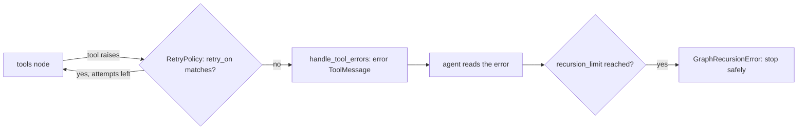

Text alternative: a node retry policy re-runs the tools node for transient errors, remaining errors become messages the model can read, and the recursion limit stops any run that keeps looping.

## D41 — Fan-out, reducer and Send

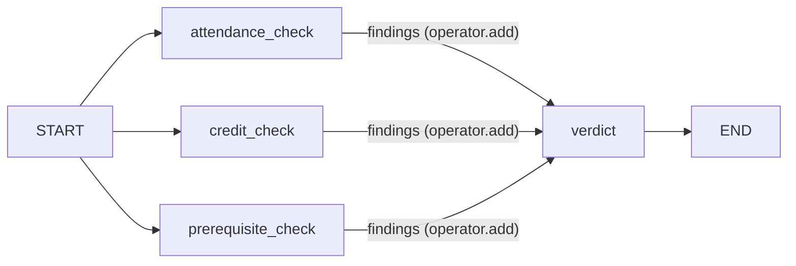

Text alternative: three nodes run at the same time from START and each appends to the findings key through a reducer; the verdict node runs once all three have finished, and Send creates such branches dynamically.

## D42 — Tools served by an MCP server

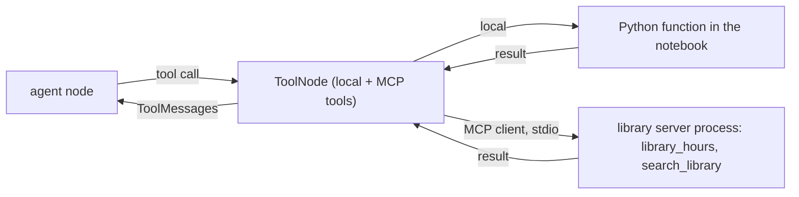

Text alternative: the client lists a server's tools and hands them to the same tools node as local functions; a call to an MCP tool travels to the server process and its result comes back as an ordinary tool message.

## D43 — Supervisor with worker subgraphs

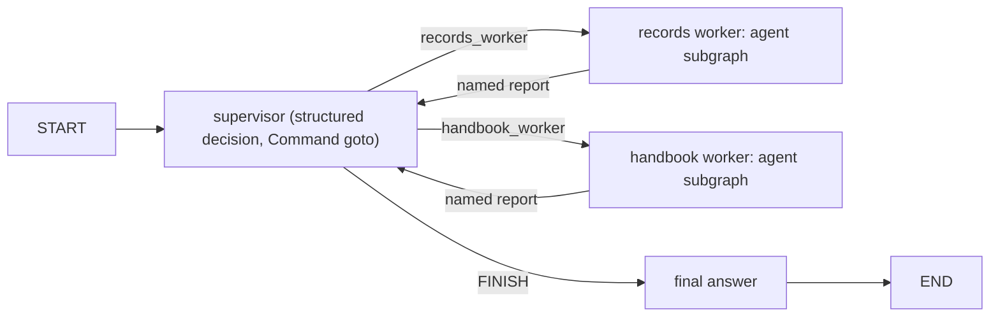

Text alternative: the supervisor node chooses the next worker with a structured decision and Command routing; each worker runs its own agent subgraph and reports back until the supervisor finishes.

## D44 — The assembled CampusAI

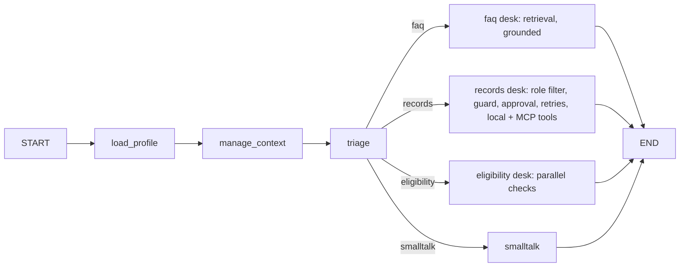

Text alternative: every turn loads the user's profile and trims the context, then triage routes it to a grounded faq desk, an approval-gated records agent with local and MCP tools, a parallel eligibility check or a small-talk reply, all persisted on one thread with a store for people.

## D45 — Scheduled runs with queued approvals

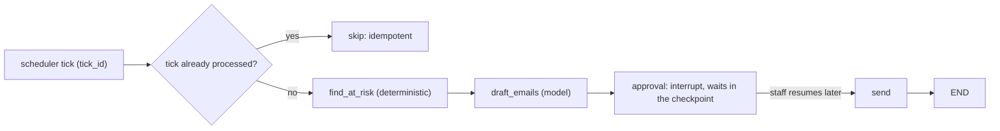

Text alternative: a scheduler tick with its own id and thread is skipped if already processed; otherwise the watcher reads, drafts with the model, and pauses at an approval that waits in the checkpoint until a staff member resumes it, at which point the emails are sent.
