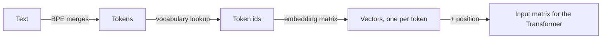
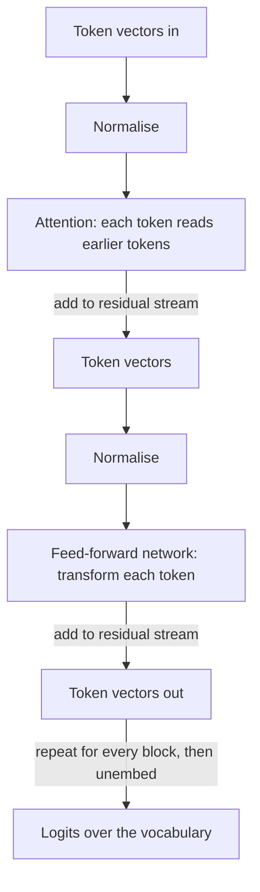
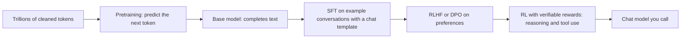
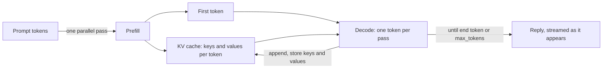
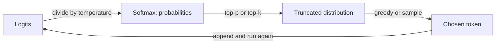

# LLM Foundation module diagram sources

## D60 — From text to tokens to vectors

Text alternative: the tokenizer splits text into sub-word tokens using its merge list, each token becomes an id, each id is looked up in the embedding matrix to give a vector, and positional information is added before the matrix enters the Transformer.

## D61 — One Transformer block

Text alternative: a block normalises the token vectors, lets each token attend to earlier tokens and adds the result, then normalises again, transforms each token with a feed-forward network and adds that too; the blocks repeat, and the final vector of the last token is projected to one logit per vocabulary entry.

## D62 — How a model is trained

Text alternative: pretraining on trillions of tokens produces a base model that completes text; supervised fine-tuning teaches the chat template, preference training shapes helpfulness and refusals, and reinforcement learning with checkable rewards adds reasoning and reliable tool use, yielding the chat model.

## D63 — Inference: prefill, decode and the KV cache

Text alternative: the prompt is processed in one parallel prefill pass that fills the KV cache and yields the first token; decode then produces one token per sequential pass, reading and extending the cache, until an end token or the length cap, streaming tokens as they appear.

## D64 — From logits to the chosen token

Text alternative: logits are divided by the temperature and turned into probabilities by softmax, the tail is cut by top-p or top-k, one token is chosen greedily or by sampling, and it is appended to the sequence before the model runs again.
