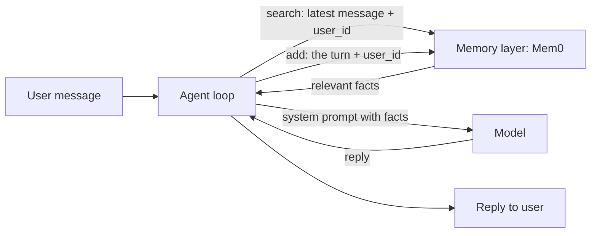
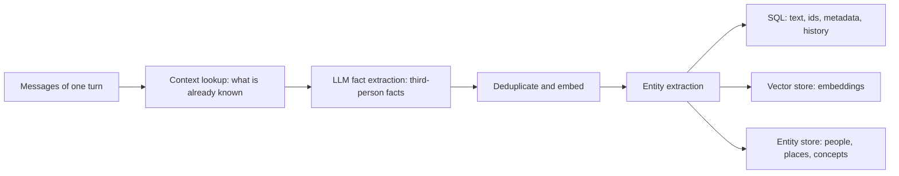
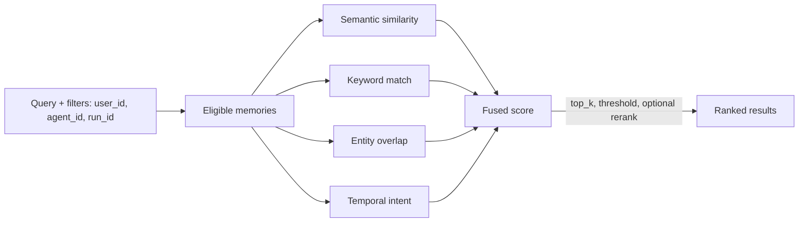
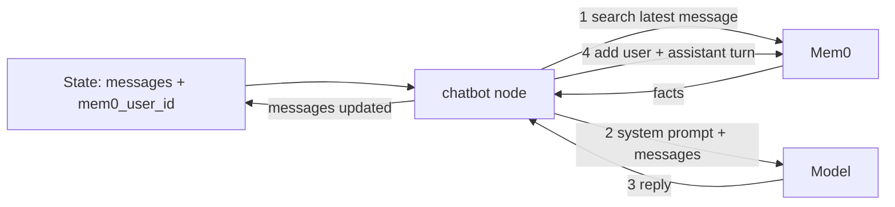
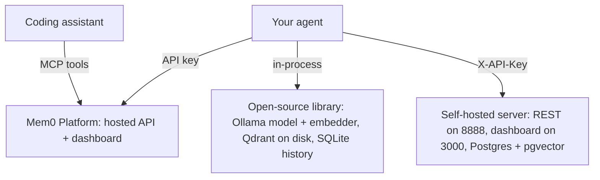

# Mem0 module diagram sources

## D65 — Where a memory layer sits beside the agent loop

Text alternative: the agent searches the memory layer with the latest message and the user id, places the returned facts in the system prompt, calls the model, returns the reply, and adds the turn to the memory layer so that later conversations can use it.

## D66 — What add does to a conversation

Text alternative: add looks up existing memories for the scope, extracts short third-person facts with a model, drops duplicates and embeds the rest, extracts entities, and writes the fact text to SQL, the embedding to the vector store and the entities to the entity store; storage is additive.

## D67 — Search fuses four signals

Text alternative: filters decide which memories are eligible, four signals score them, the scores fuse into one, and top_k, threshold and an optional reranker shape the returned list.

## D68 — Memory inside a LangGraph node

Text alternative: the node reads the messages and the user id from the state, searches Mem0, builds the system prompt with the facts, calls the model, adds the turn to Mem0, and returns the reply into the state; the checkpointer still owns the conversation itself.

## D69 — Three ways to run Mem0

Text alternative: the same agent can use the hosted Platform with an API key, the open-source library inside its own process with Ollama and a local vector store, or a self-hosted server stack with its own REST API and dashboard; coding assistants reach the Platform through MCP tools.
