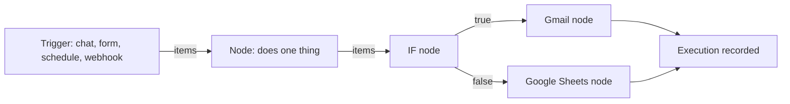
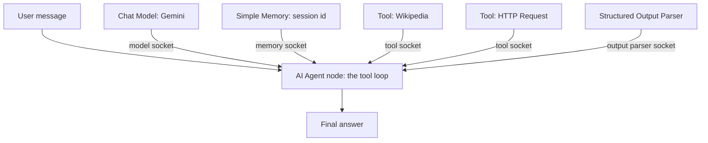
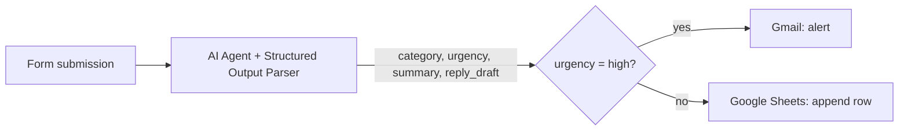
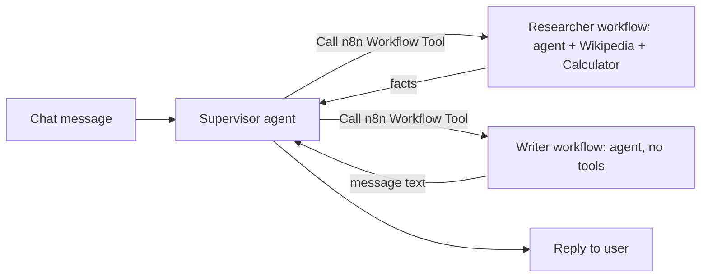

# n8n module diagram sources

## D53 — Anatomy of an n8n workflow

Text alternative: a trigger starts the workflow and emits items; each node receives items, does one thing and passes them on; an IF node splits the path; every run is recorded as an execution with the data at each node.

## D54 — The AI Agent node and its sub-nodes

Text alternative: the AI Agent node receives the user message and emits the final answer; a chat model, a memory, any number of tools and an optional output parser plug into sockets underneath it and are used by the loop inside the node.

## D55 — Ticket triage: structured output then deterministic routing

Text alternative: a form submission goes to an agent whose output parser guarantees a JSON object with fixed fields; an IF node reads the urgency enum and routes urgent tickets to an email alert and the rest to a spreadsheet row.

## D56 — Supervisor delegating to specialist workflows

Text alternative: the supervisor agent treats two other workflows as tools; each starts with a When Executed by Another Workflow trigger, runs its own agent, and returns its output to the supervisor, which composes the reply.
