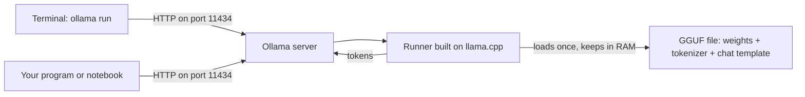
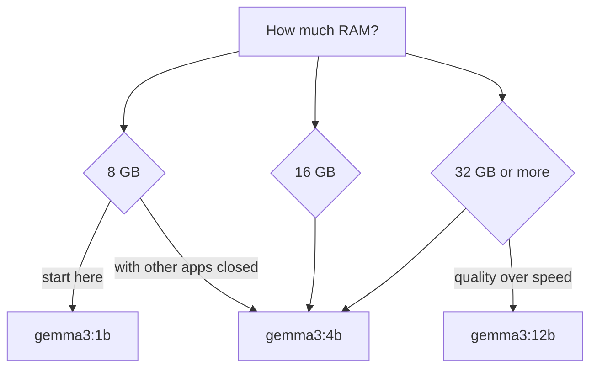
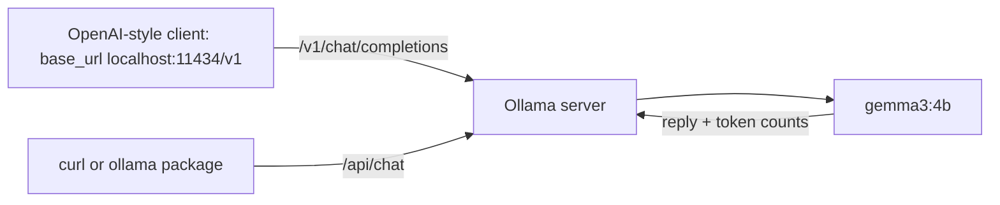

# Ollama module diagram sources

## D50 — Ollama on a laptop

Text alternative: the terminal command and any program are clients that send HTTP requests to the Ollama server on port 11434; the server hands the request to a runner built on llama.cpp, which loads the quantised GGUF file into RAM once and streams tokens back.

## D51 — Choosing a Gemma 3 size for the machine

Text alternative: the decision starts from the laptop's RAM; 8 GB points to gemma3:1b with 4b as a later experiment, 16 GB to gemma3:4b, and 32 GB or more to 4b or 12b depending on whether speed or quality matters.

## D52 — Programs talking to the local server

Text alternative: an OpenAI-style client, such as the course's chat helper with its base URL changed, reaches the model through the compatible /v1 endpoint, while curl or the ollama package use the native /api/chat endpoint; both end at the same local model, which returns the reply and token counts.
