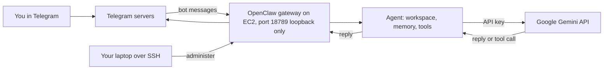
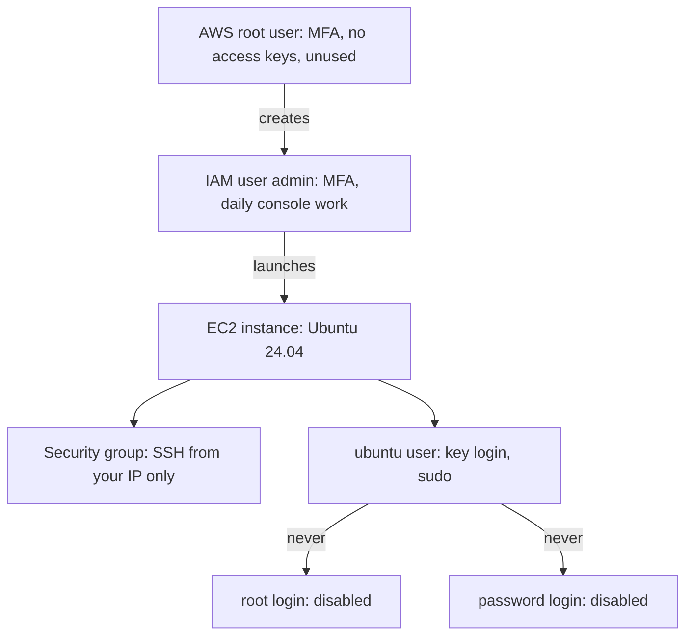
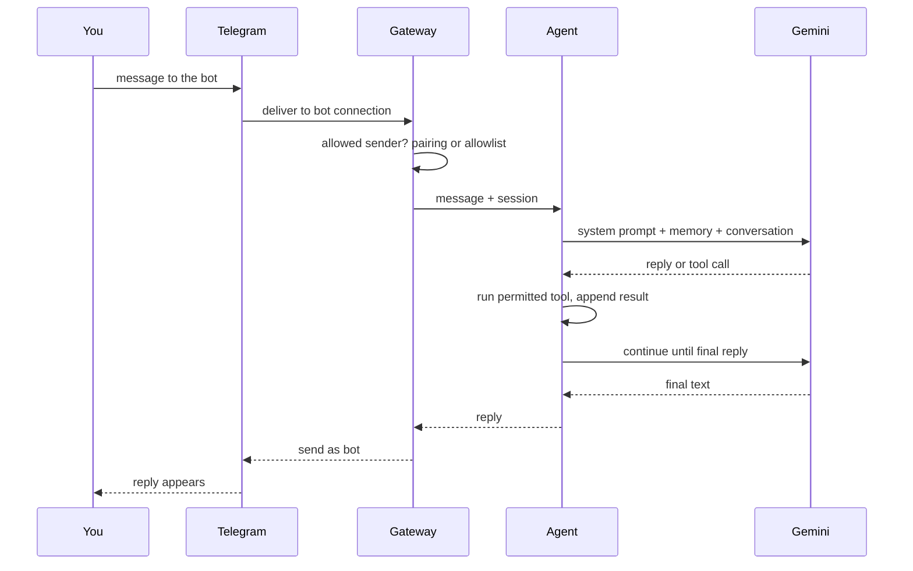

# OpenClaw module diagram sources

## D57 — OpenClaw deployed on an EC2 machine

Text alternative: messages travel from Telegram to the gateway running on the EC2 machine, the agent assembles context and calls Gemini with your API key, tools run on the machine, and the reply returns through Telegram; you administer the gateway only over SSH, since its port is bound to the machine itself.

## D58 — Two layers of identity: the AWS account and the machine

Text alternative: on the account side the root user is locked behind MFA and unused while an IAM user does the daily work; on the machine side the security group admits SSH only from you, the ubuntu user logs in with a key and uses sudo, and both root login and password login are disabled.

## D59 — One message through OpenClaw

Text alternative: the gateway checks that the sender is allowed, hands the message to the agent, which calls Gemini with its context and runs any permitted tool the model requests until a final reply is produced and sent back through Telegram.
